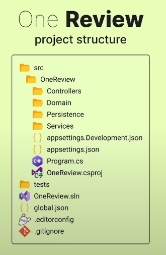

# .NET Learning Series: User Service

Part of my journey learning .NET Core by building real-world microservices.

## Purpose
A basic user management service built with .NET to understand core concepts and best practices.

## Features
- User registration and authentication
- Role-based authorization
- Profile management
- Password reset functionality
- JWT token authentication

## Tech Stack
- .NET 9.0
- Entity Framework Core
- SQL Server
- Redis (caching)
- Docker

## Architecture

<br>
inspired by [OneReview](https://www.youtube.com/watch?v=Ms0dFXx3OMc)

## Getting Started
```bash
WIP
```

## Initiating Project
1) dotnet new sln  --name ServiceName 
2) mkdir src (create source folder)
3) mkdir tests (create test folder)
4) dotnet new webapi -o ServiceName
5) dotnet new editorconfig
6) dotnet new globaljson --roll-forward latestMinor --sdk-version 9.0.0
7) dotnet new gitignore
8) dotnet sln add **/**.csproj (create project for the solution)
9) clean unnecessary files/syntax (obj folder, http file, clean the program.cs)
10) add src/Controllers folder (business logic)
11) add src/Domain folder (data layer)
12) add src/Services (interaction with database or 3rd party)
13) add src/Persistance (database)

## API Documentation
Swagger UI available at: `http://localhost:5000/swagger`

## Learning Goals
- Semi Clean Architecture in .NET
- Authentication & Authorization
- Database management with EF Core
- API security best practices
- Docker containerization

## Next Steps
- [ ] Add email verification
- [ ] Implement refresh tokens
- [ ] Add OAuth providers

## License
MIT

## Reference
[https://www.youtube.com/watch?v=Ms0dFXx3OMc](https://www.youtube.com/watch?v=Ms0dFXx3OMc)
